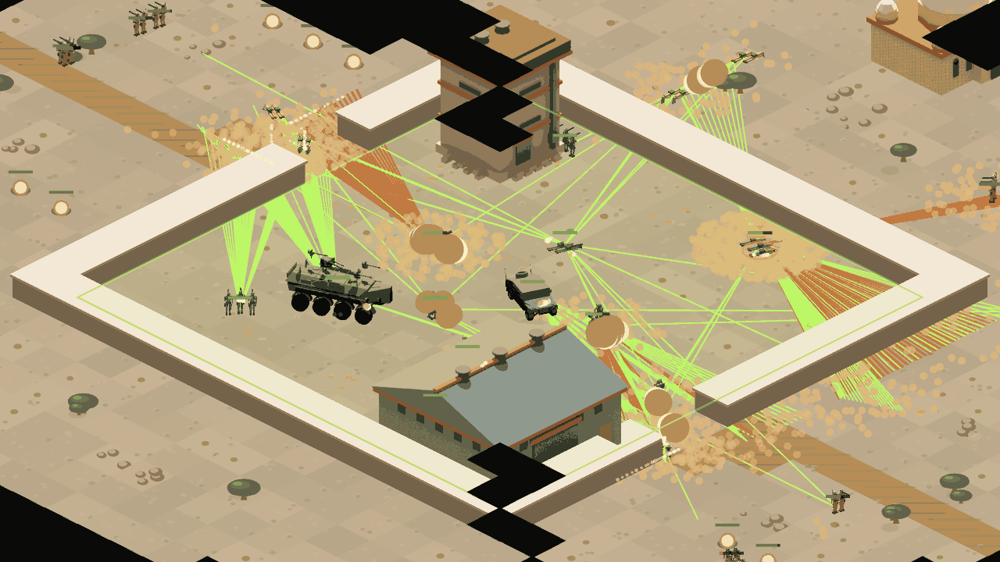
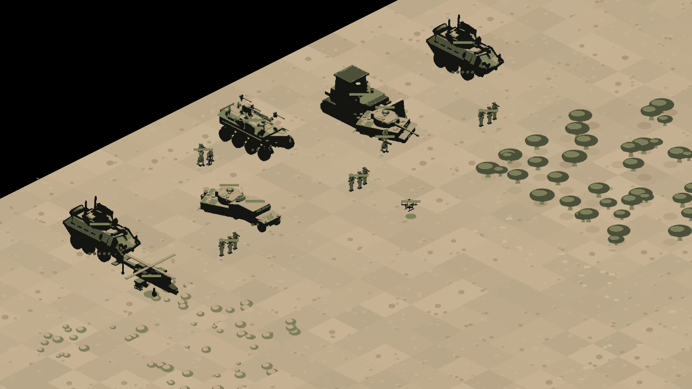

# Roaring Lions

An open-source, single-player real-time strategy game in the Command & Conquer tradition — 2:1 dimetric, TypeScript + PixiJS — whose distinguishing claim is that combat **simulates real engagement odds** instead of trading hit points. Fights resolve through a detect → hit → penetrate → component-damage chain, and suppression, not damage, is the dominant battlefield force.

All geography and factions are fictional. Enemy forces are defined by military doctrine — tunnels and ambush, standoff fires, mobile raiding — never by ethnicity, nationality, or faith.



## Status — M0 complete

The combat model is the product, and it is calibrated: the backtest harness (`pnpm balance`) reproduces every validation target in the design document.

| GDD §5.7 target | Measured |
|---|---|
| Urban assault needs ≈3:1 attacker:defender | 1:1 = 0% · 2:1 = 15% · **3:1 = 95%** · 4:1 = 100% |
| ATGM Pk vs unprotected armour ≈ 0.7 | **0.67** over 400 launches |
| APS intercept 0.6–0.9 vs shaped charge | **0.73** |
| Lanchester's square law emerges | 12v6 → 12.0 survivors (square-law predicts 10.4; linear 6) |
| Air is contested by anti-aircraft fire | 1 gun truck → 80% survival · 3 → **0%** |

M1 — the Beit Sahwan missions, campaign ledger, ROE scoring, and a playable link here — is in progress.

## Play it

**<https://ilan-pinto.github.io/roaring-lions/>** — the current build, deployed
from `main` on every push (and only when `test:determinism` and the §5.7
backtest pass).

Pick a mission from the menu, or open the M0 sandbox. Left-drag selects,
right-click orders, right-click a building garrisons the infantry that can
enter it. `Ctrl`+`1`–`9` assigns a control group, `1`–`9` recalls it. Every
roll the model makes is in the feed on the right; `o` hides it.

## What is in it



**Combat.** Detection, six-factor hit resolution, penetration curves, component
damage (mobility and firepower kills are separate outcomes), APS interception,
suppression and rout. Hover a target to see the projected hit chance before you
commit to the shot.

**Missions.** Five authored missions in Beit Sahwan — a tutorial that teaches
the roster and control groups, a recon sweep, a foothold, a clearance, and the
First Light defence. Objectives are declarative data, never TypeScript:
`survive_until`, `hold_for`, `locate`, `capture`, `eliminate_hvt`,
`destroy_all`, `evacuate_before`. Missions target 5–7 minutes, so a balance
change can actually be re-tested.

**Campaign.** A ledger carries surviving units, ROE ratings and intel between
missions, with a world map of the Sahar Basin. Rules of engagement are scored,
and unit unlocks are gated on that score — collateral damage costs you options
rather than a lecture.

**Command.** Control groups, attack-move that sweeps toward last contact instead
of stalling, garrisoning, smoke screens, field production and reinforcement, and
intel sinks — a satellite sweep and a precision strike.

**Presentation.** Sprites rendered through a locked 36-colour palette and a
Blender rig, speed-linked walk cycles, turret settle, recoil and hit flinch,
persistent wreckage, and data-driven VFX emitters authored as JSON. The
simulation never sees any of it — invariant 4 is one-way.

## Quickstart

```bash
pnpm install
pnpm dev          # M0 sandbox: click to select, right-click to attack-move
```

In the sandbox, every roll the model makes — detection probability, the six hit factors, penetration curve, component result, APS intercept, suppression — streams through the debug overlay. `window.__lions.step(n)` in the console fast-forwards n deterministic ticks.

| Command | What it does |
|---|---|
| `pnpm test` | unit tests |
| `pnpm test:determinism` | 1000-tick replay against a pinned state hash |
| `pnpm lint` | includes mechanical enforcement of the sim invariants |
| `pnpm validate:data` | JSON Schema gate on all content |
| `pnpm validate:assets` | palette + silhouette gate (needs `numpy`, `pillow`) |
| `pnpm validate:ui` | rejects colour literals in UI source |
| `pnpm balance` | headless backtest against the §5.7 targets |

Two headless walkers exist for content that no unit test can see, because each
test builds its own small world rather than loading an authored one:

```bash
npx tsx tools/src/walk_mission.ts beit_sahwan_breach 0 60 150 300
```

prints the real mission's world at chosen seconds — the tool that catches a
trigger timed past the end of a mission, or a group nothing commits.

## Architecture

pnpm workspace, one-way dependency direction: `app → render → sim`, with `data` as a leaf and `tools` alongside.

Four load-bearing invariants (see `CLAUDE.md`):

1. The sim runs a fixed 20 Hz tick; the renderer interpolates.
2. `@lions/sim` is Q16.16 fixed-point — no floats, no `Math.*`, enforced by lint. Trig/exp/Φ come from committed lookup tables.
3. All randomness is a seeded per-entity PRNG — entity counts can change mid-mission without reshuffling anyone's rolls.
4. Commands in → sim → state + events out. Nothing outside the sim mutates sim state.

Determinism is not aspirational: CI replays 1000 ticks on Linux, macOS, and Windows and asserts the same golden hash.

## Contributing

Read `CONTRIBUTING.md` first — units, missions, VFX, and maps are JSON gated by validators; art goes through a locked render rig with a 36-colour palette and a silhouette-readability check. The cost-curve and headless-battle gates mean balance arguments are had with evidence.

Design documents: [`docs/GDD.md`](docs/GDD.md) · [`docs/ART_PIPELINE.md`](docs/ART_PIPELINE.md)

## License

Code is MIT. Art and game data are CC BY-SA 4.0 (see `data/LICENSE.md`). All contributions require a DCO sign-off (`git commit -s`).
