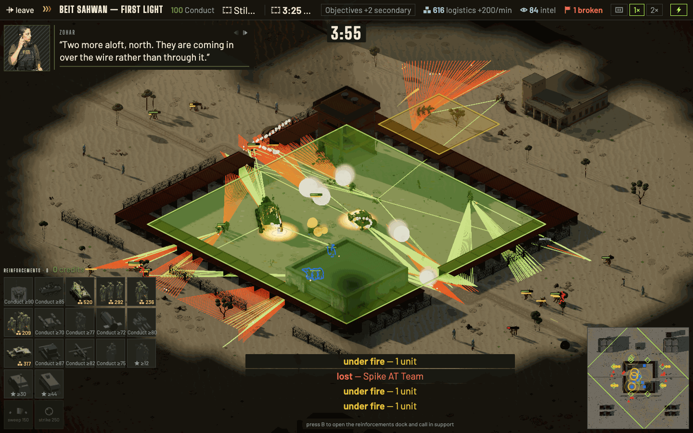
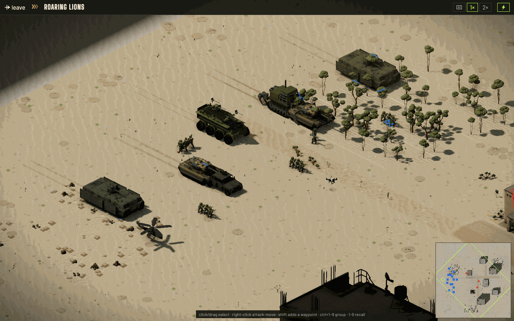

# Roaring Lions

A source-available real-time strategy game in the Command & Conquer tradition: 2:1 dimetric, TypeScript + three.js, a lit renderer drawing rigged 3D meshes. (The PixiJS sprite fallback was retired in WP-A3.3.) Its distinguishing claim is that combat **simulates real engagement odds** instead of trading hit points. Fights resolve through a detect → hit → penetrate → component-damage chain, and suppression, not damage, is the dominant battlefield force. Single-player today; the sim is deterministic and command-driven so that multiplayer can follow.

All geography and factions are fictional. Enemy forces are defined by military doctrine — tunnels and ambush, standoff fires, mobile raiding — never by ethnicity, nationality, or faith.



*Captured from the shipped three.js renderer on 2026-09-30 at 1440×900 (`beit_sahwan_breach`, sim tick 1300, zoom 1.0).*

## Play it

**<https://roaring-lions.pint12.workers.dev>** — the current build, served by a Cloudflare Worker built from `main`. It needs a WebGL2-capable browser; without one, the campaign board falls back to its flat map, and missions need WebGL2. Source and issues: <https://github.com/ilan-pinto/roaring-lions>.

The menu leads with where the campaign stands — Start or Continue and the mission's name — then Campaign, Brigade, the tutorial (*Working Up*, 14 steps), Free play, Saves, Settings, New campaign, sound and Credits. Free play walks any shipped map with a full task force and optional extras: civilians and a refuge, a pre-dug tunnel and sappers to collapse it, the Sarim roster, an anti-tank ditch, no-fire ground, and three diagnostic toggles.

The first minute:

- Left-drag box-selects; a click that stays put selects the unit under the cursor, and a click on empty ground clears the selection. A right-click on the ground is an attack-move — units engage what they meet on the way; there is no plain move from the mouse — and `Shift` queues the order behind the current one.
- Right-click a building and the troops that can enter it garrison it, while a demolisher — Combat Engineers or the D9 — levels it. An attack on a protected building (a hall) is refused, with a note saying why, unless `Alt` is held or the selection is nothing but demolishers.
- `Ctrl`+`1`–`9` (`Cmd` on a Mac) assigns a control group, `1`–`9` recalls it and a second tap within 400 ms centres the camera on it; `Ctrl`+`A` selects every unit and `Tab` cycles the HUD chips. `h` halts, `f` lays smoke at the cursor, `g`/`u` load and unload, `i` selects the next idle unit, `Space` jumps to the latest alert, `W`/`S`/`A`/`D` and the arrows pan, the wheel zooms, and the minimap takes right-click orders too.
- `F1` lists every binding; `Esc` backs out of whatever is open or armed and otherwise pauses. Every binding except `Tab` and `Esc` can be rebound under Settings › Controls; the control-group digits, the arrow keys and the mouse buttons are fixed.
- With units selected, hover a visible enemy and the *Projected fire* panel shows each unit's hit chance — and what is degrading it — before you commit to the shot. `o` (rebindable) opens the debug overlay, which streams every hit, penetration and APS roll with the full factor breakdown.

The live build sends play telemetry to `/api/events` on the same origin — session, mission, campaign and brigade events under a random player id kept in `localStorage` — and the game's own database keeps no e-mail, IP or URL. `?notrack` opts out and persists that choice in `localStorage`, and Global Privacy Control and Do Not Track are honoured. `?tester=<name>` labels a tester cohort; aggregates are read on `/stats`, which is password-protected.

## What is in it



*Captured from the shipped three.js renderer on 2026-09-30 at 1440×900 (`/free-play/beit_sahwan_outskirts`, the force walked five tiles off its assembly point, zoom 1.6).*

**Combat.** Detection, six-factor hit resolution, penetration curves, component damage (mobility and firepower kills are separate outcomes), APS interception, suppression and rout. Cover is the big lever: `COVER_HIT` steps 1 / .375 / .1375 / .09 and `COVER_SUPP` 1 / .475 / .1375 / .09. A dug-in target is both harder to hit and harder to pin, which is why clearing a held town takes roughly 3:1. Every knob the balance backtest calibrates against the GDD §5.7 targets lives in `packages/sim/src/tuning.ts`, mostly as raw Q16.16 integers with the decimal value in a trailing comment.

**Missions and campaign.** 27 mission files: 26 campaign missions plus the tutorial. Three fronts open in order on a 3D diorama of the Sahar Basin: the Marj Strip (Beit Sahwan 5, Khan Rafid 3, Deir Amun 3), Sur (Tel Marum 3, Qarn Hadid 3, Umm Zeitoun 4) and Naharin (Wadi Halam 5). The war opens with *First Light*, a dawn siege: a company's remnant holds a compound on the Beit Sahwan road until relief arrives. Objectives are declarative data, never TypeScript, from nine live types: `locate`, `hold_for`, `survive_until`, `capture`, `eliminate_hvt`, `evacuate_before`, `collapse`, `raze` and `destroy_all`. Every mission declares `target_minutes`: 5–7, schema-enforced, with the tutorial's 10 the one named exemption.

**Conduct and progression.** Every mission scores Conduct 0–100; civilian casualties, damage to flagged structures and disproportionate ordnance deduct. A victory is graded ★, ★★ (Conduct at or above the mission's floor + 20, or 70 where none is declared) or ★★★ (every carrying secondary complete). A ledger carries named units with service records, Conduct ratings, stars, intel, evacuated civilians and recovered hostages between missions. Units unlock on campaign-average Conduct (floors of 70–90), on total stars (12, 30 and 44) or for credits; the earned path is always free.

**Brigade.** A campaign win pays credits — 100 for the win, 40 per carrying secondary, 10 per starting-force unit brought home, 1 per Conduct point over the ★★ floor; a replay pays only the improvement, a defeat nothing. Spend them in the garage: a gated unit early, or three-tier `armour`, `sensors` and `firepower` tracks that apply to every unit of that type (`inf_squad` armour runs 115/175/250). Bought tiers are patched into the unit JSON before the sim ever sees it. The account survives a new campaign. Credits are never sold.

**Command.** Control groups with a group bar, attack-move that sweeps toward last contact, garrisoning, mount/dismount, smoke screens, demolition, field production and reinforcement from a dock, and intel sinks — a satellite sweep and a precision strike. Around the fight: an alert feed, an objectives tracker, a minimap showing only the enemies you are observing, a pause menu with settings, and save slots. A deploy screen picks which veterans fill a mission's slots, and the debrief lists Conduct deductions by reason, losses by name and the credit payout.

**Presentation.** Lit three.js since v0.63.0, with `high`/`medium`/`low` quality presets. Units, vehicles and buildings are rigged meshes: 89 GLBs, Draco-encoded to 27 MiB. Infantry crossfade between clips and die on screen; vehicles pitch, settle and leave a 3D wreck. The ground is a smooth splat surface with roads, decals, scatter, trees, haze and time of day. Mortar bombs and rockets arc, tank rounds fly as bolts, the Spike dives onto the roof, and a vehicle kill is a blast with light, shake and hit-stop. `data/palette.json` still supplies colour as a lighting input; the per-pixel guarantee is retired. The sprite sheets are retired too (WP-A3.3): every unit and building is a mesh, and a unit whose GLB fails to load draws as a team-coloured box rather than nothing.

**Audio.** Music, SFX and voice lines are declared in `data/audio.json`, gated by `pnpm validate:audio`. A voice director degrades repeats line → acknowledgement → silence; the brigade speaks Hebrew, Ashwar, Sarim and Rif speak Arabic, civilians are silent. Ten Hebrew voice files ship so far and no Arabic ones; a line with no recording plays nothing. Unplaced lines pass through a 300–3400 Hz radio band and a walkie-talkie effect applied at playback; a captions setting prints the English text.

## Status

The combat model is the product, and it is calibrated. `pnpm balance` runs six cases twice, on the shipped roster and again with every KDF unit at its maximum upgrade tiers, and both tables must pass. Four cases are the GDD §5.7 targets; the air case is the harness's own addition, and the smoke step is a separate GDD-specified case kept outside the four model targets. The GDD's three extended targets (ambush, standoff, raid) are not measured by anything yet.

| Backtest case | Base roster | Max upgrade tier |
|---|---|---|
| Urban assault needs ≈3:1 attacker:defender (60 seeds per ratio) | 1:1 = 0% · 2:1 = 63% · **3:1 = 100%** · 4:1 = 100% | 1:1 = 0% · 2:1 = 55% · **3:1 = 80%** · 4:1 = 98% |
| Smoke buys exactly one ratio step (one screen per assault group) | 1:1+smoke = 0% · **2:1+smoke = 100%** (60/60) | 1:1+smoke = 0% · **2:1+smoke = 97%** (58/60) |
| ATGM Pk vs unprotected armour ≈ 0.7 (0.60–0.80) | **0.67** over 400 launches | **0.77** over 400 launches |
| APS intercept 0.6–0.9 vs shaped charge | **0.73** over 400 engagements | **0.73** over 400 engagements |
| Lanchester's square law emerges (20 seeds per case) | 12v6 → 12.0 survivors (square 10.4, linear 6) · 16v8 → 16.0 (square 13.9, linear 8) | same |
| Air is contested by AA (harness target, not in GDD §5.7; 30 seeds per case) | 1 gun truck → 80% survival · 2 → 0% · 3 → **0%** | 1 → 100% · 2 → 30% · 3 → **30%** |

Done: the combat model, the Beit Sahwan arc with its ledger and Conduct scoring, and six more town arcs — 26 campaign missions in seven towns plus a tutorial as of v0.94.0. The shell has landed its first three phases, and unit voices beside them. Phase 3's remaining half — deploy as a decision, victory and defeat moments, the art pass — is in flight; Phase 4 (Steam Deck, controller) is unscheduled. Next is the commander's HUD and one visual register, due 30 October 2026; the live ledger is [`docs/HANDOVER.md`](docs/HANDOVER.md).

## Quickstart

Node 22 (what CI runs) and pnpm 11.17.0 (the `packageManager` pin in `package.json`). The audio gate needs Python 3 with `numpy`. The mesh gate needs `numpy`, `pillow` and Blender (CI installs 5.2.0), found through `BLENDER_BIN`, `blender` on `PATH`, `/Applications/Blender.app` or `--blender`. The visual gate and the UI tools need Playwright Chromium.

```bash
pnpm install
pnpm dev          # Vite on http://localhost:5173 — the main menu; /free-play/<map id> (or ?sandbox=<map id>) walks a map without a mission
```

On any battlefield, `o` opens the debug overlay (off by default): a status pane on the left, every hit, penetration and APS roll on the right. In the console, `__lions.help()` — printed on every Free play boot — lists the map that loaded, which flags are on, the Free play extras, every shipped map id and the helpers: `step(n)`, `goto(marker)`, `units()`, `sel([id])`. `__lions` exists only on a battlefield.

| Command | What it does | Needs |
|---|---|---|
| `pnpm test` | unit tests — 366 files, 7,472 specs; roughly 1¼ min locally | — |
| `pnpm test:determinism` | 1000-tick replay against the pinned hash `2109596329`; CI runs it on Linux, macOS and Windows | — |
| `pnpm typecheck` | `tsc --noEmit` across the workspace | — |
| `pnpm lint` | eslint; inside `@lions/sim` it bans `Math`, `Date`, wall-clock APIs, `crypto`, float literals and non-relative imports, and it pins the `app → render → sim` direction | — |
| `pnpm validate:data` | JSON Schema gate on every content file — units, missions, VFX, maps, tutorial, campaign, menu diorama — plus palette, structure and cross-reference checks | — |
| `pnpm validate:meshes` | the art gate: palette and reserved-band colours, binary alpha, framing, silhouette fill and pairwise-silhouette IoU on every unit, building and vehicle GLB under `art/meshes/`, rendered headlessly through Blender, plus the building-facing gate and the vehicle wreck contract (the sprite gate, `validate:assets`, was retired with the sheets) | Python 3, Blender 5.2, `numpy`, `pillow` |
| `pnpm validate:ui` | UI source gate: no colour literals or unresolved tokens, no raw `--rl-*` outside `theme.css`, no untagged layout `px`, no retired dingbats, no bare chrome strings | — |
| `pnpm validate:audio` | licence, source, format, size and gain gate on every clip and voice line | Python 3, `numpy` |
| `pnpm balance` | the six backtest cases above, base and max-tier rosters; exits 1 on any miss | — |
| `pnpm playtest` | a scripted plan must win each of the 26 campaign missions at ★★ or better within 20 minutes, and each town's passive control must lose | — |
| `pnpm perf:units` | times `sim.tick()` at 65, 150, 300 and 400 units, fails past a budget | — |
| `pnpm encode:meshes` | Draco-compress `art/meshes/` into the `assets/meshes/` that ships (`-- --check` in CI) | — |
| `pnpm golden-baseline` | three-vs-three visual gate against `tools/golden-baselines/<envKey>/`; `:bless -- --reason="…"` accepts a change; exit 3 means no baseline for this environment | Playwright Chromium |
| `pnpm ui:routes` | Playwright walk of the shell: mission to mission with no reload, then the garage, unit voices and a no-telemetry guard; starts its own dev server | Playwright Chromium |
| `pnpm ui:shots` | screenshot 34 named shell screens and HUD states at 1400×900, 1920×1080 and 2560×1440 into `.superpowers/ui-shots/`; boots its own dev server on :5176 | Playwright Chromium |
| `pnpm meshy -- <cmd>` | Meshy text/image-to-3D proxy with an estimate before any spend and a ledger | `MESHY_API_KEY` or `~/.config/roaring-lions/meshy.env` |
| `pnpm build` | production build to `packages/app/dist`, what the Cloudflare Worker serves | — |

CI (`.github/workflows/ci.yml`) runs on every PR and push to `main`. A `gates` job runs lint, typecheck, test, every validator, the cost-curve gate (`python tools/validate_balance.py`), `balance`, `playtest`, `perf:units` and `build`. A `visual` job runs the golden gate and `ui:routes`, and `test:determinism` runs on Ubuntu, macOS and Windows. A `version` job tags a release when commits since the last tag include a `feat` or `fix`. A nightly (`visual-baseline.yml`) re-runs the visual gate on the Linux baseline; a failure opens or updates one `visual-baseline` issue.

Three headless walkers under `tools/src/` load an authored mission the way the app does and print what it actually does at chosen times. That is how content bugs that pass every fixture-based test — a trigger naming an undeclared group, a drop timed after the carrier has driven past — get found. None is a pnpm script; each runs through the tools workspace's `tsx`:

```bash
pnpm --filter @lions/tools exec tsx src/walk_mission.ts beit_sahwan_breach 0 60 150 300   # the real mission's world at chosen seconds
pnpm --filter @lions/tools exec tsx src/walk_placements.ts wadi_halam_5_depot              # the map with every placement overlaid; fails on a bad one
pnpm --filter @lions/tools exec tsx src/walk_carryover.ts                                  # Beit Sahwan I's recon intel carried into III, fresh vs carried spawns side by side; fails on a tag the two disagree on
```

## Architecture

pnpm workspace with a one-way dependency direction: `app → render → sim`, with `data` a leaf that `app`, `tools` and `worker` also import. `tools` may import only `sim` and `data`; `packages/worker`, the Cloudflare Worker serving the build and the telemetry endpoints (`/api/events` into D1, `/stats`), imports only `data`. Lint enforces the direction for `sim`, `render`, `data` and `tools`. The renderer is behind one interface (`packages/render/src/api.ts`), and three.js arrives by dynamic import, so the shell paints before it loads. Content is JSON validated against `data/schemas/`; a new unit is JSON plus art, and the sim never changes for it, though the app's mesh table (`mesh-catalogue.ts`) needs an entry.

Four load-bearing invariants (see `CLAUDE.md`):

1. The sim runs a fixed 20 Hz tick; the renderer interpolates between ticks on every frame.
2. `@lions/sim` is Q16.16 fixed-point; lint bans `Math`, `Date`, `parseFloat`, wall-clock timers, `crypto` and float literals in `packages/sim/src`. Trig/exp/Φ come from committed lookup tables (`gen/tables.ts`); regenerating on another engine can move an entry by 1 ulp, so a regenerated table is diffed, not trusted.
3. All randomness is a seeded per-entity PRNG — entity counts can change mid-mission without reshuffling anyone's rolls. `pnpm test:determinism` replays 1000 ticks from seed `0x1310_0001` twice and asserts the golden hash `2109596329` on Linux, macOS and Windows.
4. Commands in → sim → state + events out. Nothing outside the sim mutates sim state.

## Contributing

Read `CONTRIBUTING.md` first. Units, missions, VFX and maps are JSON gated by validators; missions target 5–7 minutes, and the schema is the authority where `CONTRIBUTING.md` still says 12–20. `python tools/validate_balance.py` holds every non-civilian unit to within ±18% of the fitted cost curve. Meshes go through `pnpm validate:meshes`. A mesh style bible (`docs/art/style-bible.md`) awaits the lead's approval — guidance, not a gate. AI-generated art is permitted, including for shipping assets, provided the PR discloses it. Contributions are accepted under `CLA.md` with a DCO sign-off (`git commit -s`).

## Documents

- [`docs/GDD.md`](docs/GDD.md) — what the game is; §5.7 is the authority over §5's formula text
- [`docs/HANDOVER.md`](docs/HANDOVER.md) — the programme ledger: lanes, gates, milestones, landed log, open decisions
- [`CLAUDE.md`](CLAUDE.md) — how to work here
- [`docs/ART_PIPELINE.md`](docs/ART_PIPELINE.md) · [`docs/art/style-bible.md`](docs/art/style-bible.md) · [`docs/ASSET_PROVENANCE.md`](docs/ASSET_PROVENANCE.md) — how art is made, judged and accounted for
- [`docs/campaign/README.md`](docs/campaign/README.md) (the campaign design contract) · [`docs/campaign/storyline.md`](docs/campaign/storyline.md) · [`docs/campaign/names.md`](docs/campaign/names.md) and [`docs/campaign/heroes/concepts.md`](docs/campaign/heroes/concepts.md) (naming and hero rules for mission authors) · [`docs/campaign/economy/prices.md`](docs/campaign/economy/prices.md) · [`docs/campaign/economy/upgrades.md`](docs/campaign/economy/upgrades.md)
- [`docs/PERFORMANCE.md`](docs/PERFORMANCE.md) — sim and renderer budgets with capture conditions; re-run before quoting
- [`docs/design/README.md`](docs/design/README.md) — the HUD spec and wireframes, design intent rather than a contract with the code
- [`data/locales/README.md`](data/locales/README.md) — how mission-text localisation is meant to work; the app ships `en` only
- `docs/superpowers/specs/` (76 dated design specs) and `docs/superpowers/plans/` (67 implementation plans)
- [`CONTRIBUTING.md`](CONTRIBUTING.md) · [`CLA.md`](CLA.md) · [`LICENSE`](LICENSE) · [`data/LICENSE.md`](data/LICENSE.md)

## License

Code is source-available under the PolyForm Noncommercial License 1.0.0 ([`LICENSE`](LICENSE)): read, run, modify and contribute for noncommercial use; commercial and closed licensing is the project owner's alone. Art and game data are all rights reserved (see [`data/LICENSE.md`](data/LICENSE.md)). Contributions are accepted under [`CLA.md`](CLA.md) with a DCO sign-off (`git commit -s`). The code was MIT before 2026-09-18, and copies obtained under MIT stay MIT.
