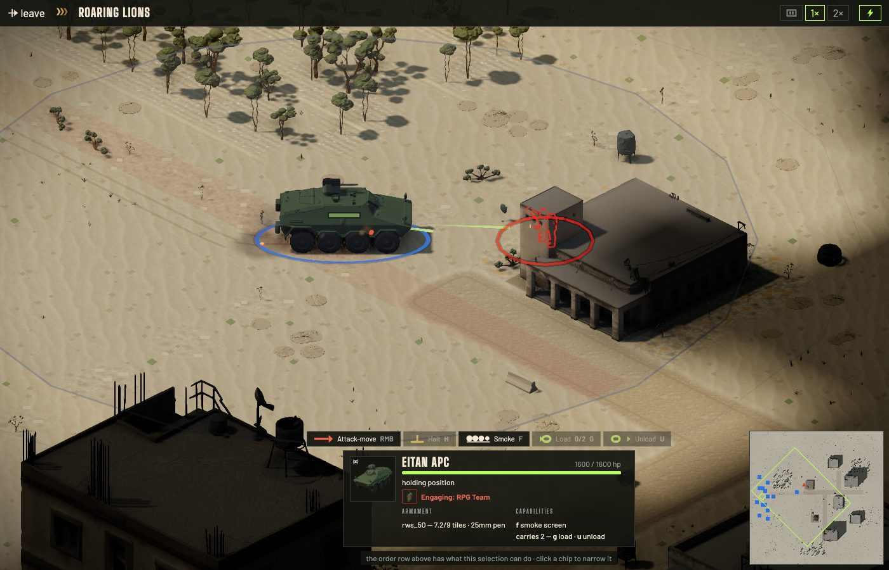
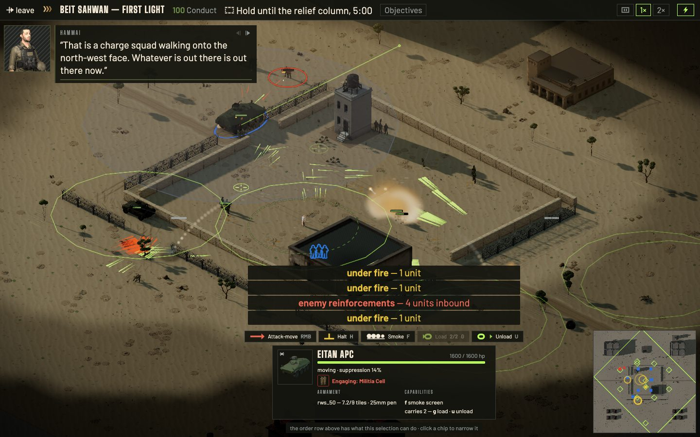
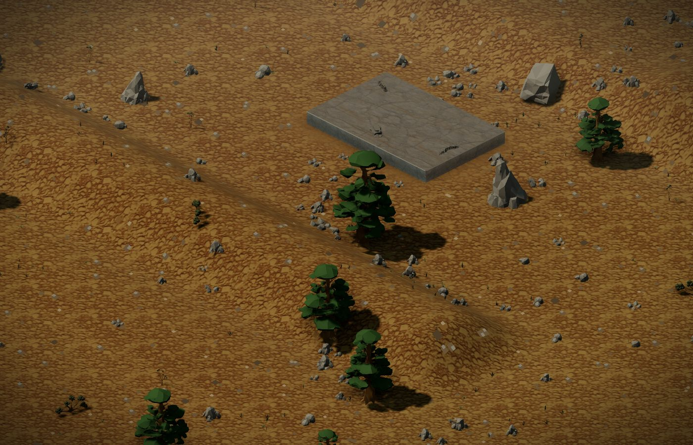

# Devlog 01: Who is shooting whom

*Roaring Lions, 28 September to 3 October. Draft for the lead to publish.*

**Suggested title:** Devlog 01: Who is shooting whom, and what it costs

**One line for social posts:** A week on Roaring Lions: textured infantry and vehicles, a shooting link you can read at a glance, and a first session that teaches one verb at a time.

---

Roaring Lions is a real-time tactics game set in the invented Kedem campaign: a small force, a fixed tick, and combat that resolves the way it should rather than the way it is convenient. This is the first fortnightly note. It covers what landed, in the order it matters.

## What landed

**The units look like people and machines now.** Infantry and vehicles were rebuilt with textured models and fitted to the existing rigs and animation. The Namer got a second pass. Every unit has a portrait, shown in the HUD, the reinforcement dock and the brigade screen. Per the usual disclosure: the models are Meshy-assisted, which means AI-generated base meshes, finished and rigged by hand in Blender.

**A new biome.** The Sur highland has terra rossa ground, cedars and more exposed rock. The relay hut and pump house are in, and buildings now show damage states as they take fire.

**You can see who is shooting whom.** Selecting a unit now draws a pulse from shooter to target, a target takes a hit flash, and machine-gun fire is drawn as travelling streaks instead of a single flat line. Selection rings are larger, and contacts leave a marker on the ground, so a unit at the edge of sight stays findable at the default zoom.

**A first session that does not bury you.** The tutorial went from fourteen steps to nine, and each step teaches one verb and shows one new piece of interface. The opening mission, First Light, is cut to two problems: hold the yard until relief, and get two families inside before the ring closes. The dock and logistics now wait for Beit Sahwan II, the first mission that needs them.

**The Roar coin exists, as a test preview.** There is a Stores tab where test coins buy what credits already buy. It is not on sale, there is no real-money purchase path, and nothing about it is final.

Nothing here changes how combat resolves: the sim, its tick and its numbers are untouched, and this week was about making what it already does readable. That is the theme, and the reason for the title.

No release date and no price yet. Those come with the store page.

## Design note: why the Conduct invoice exists

Every mission has a Conduct score: how cleanly you fought. Shelling a clinic costs you. Killing civilians costs you. Dropping a round too close to your own people costs you. The system has been in the sim for a long time, and it was nearly invisible.

When we played the first session on a clean build, Conduct was a number in the top strip. The feed printed the sim's own reason string, something like "fire into protected structure (z_clinic) → 95". The end screen said "Conduct 100". A player who lost twenty points had no way to learn which action cost them.

That matters because restraint is a mechanic in this game, not a lecture. If the price of a shot is not legible at the moment it is paid, the player cannot make the trade deliberately, and the system reads as arbitrary punishment.

So the invoice is plain accounting. Each deduction is grouped by cause and place and named in the feed as it happens ("Clinic struck, minus 5, Conduct 95"). The strip keeps a running ledger. The end screen reads "Conduct 85, Clinic struck twice, minus 10". The debrief is a table of cause, time, cost.

The tutorial's ninth beat is the lesson: fire a mortar near a flagged house and watch the invoice open. It states the price and does not say the shot was wrong.

One honest wart. The invoice currently classifies the sim's reason strings in the app, because the sim does not yet emit a structured category. A test lists every template literally and fails if one changes. That is a stopgap, and a structured field is on the list.

## Captures

*The shooting link: the APC's tracer, a contact ring on the target, and the card naming what it is engaging.*

*First Light after the cut: one countdown, Conduct in the strip, Hammai on the radio.*

*The Sur highland biome, with its first cedars.*

