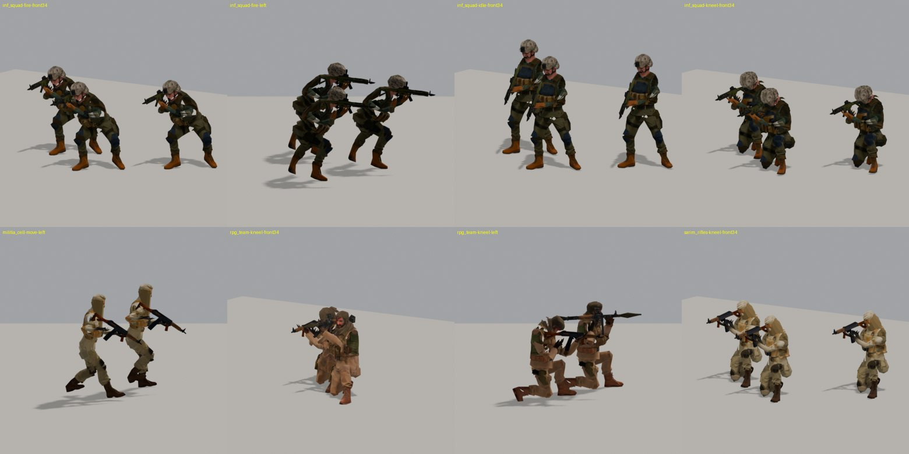
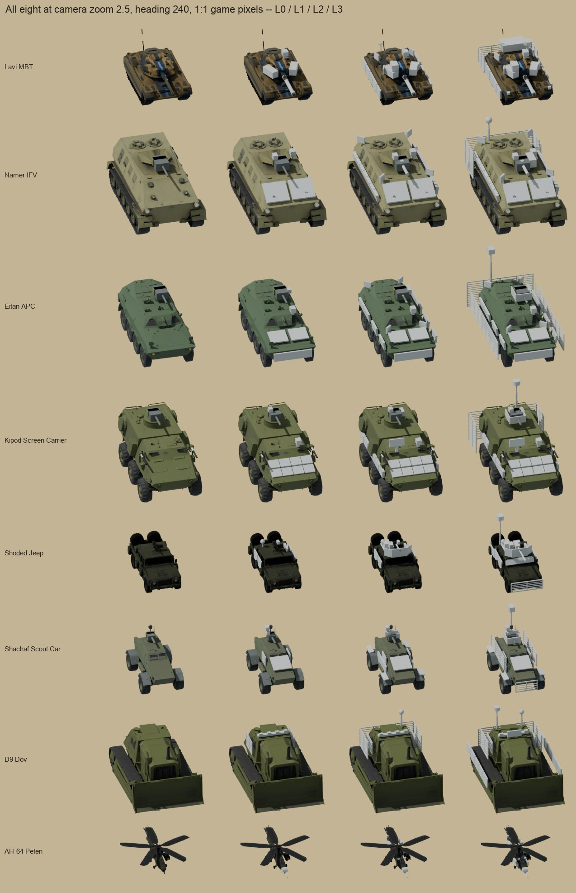
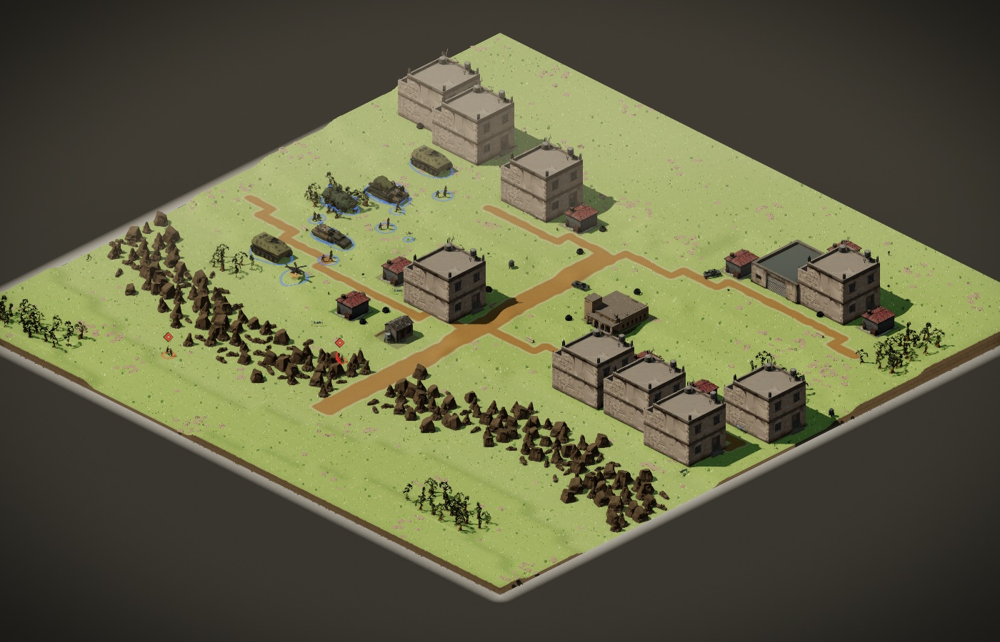
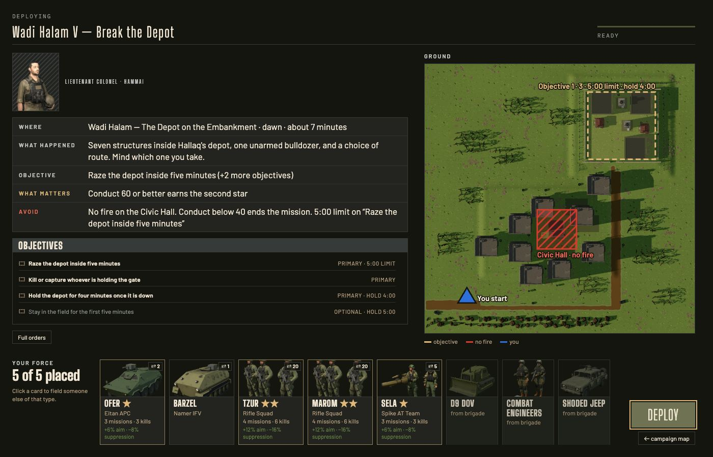
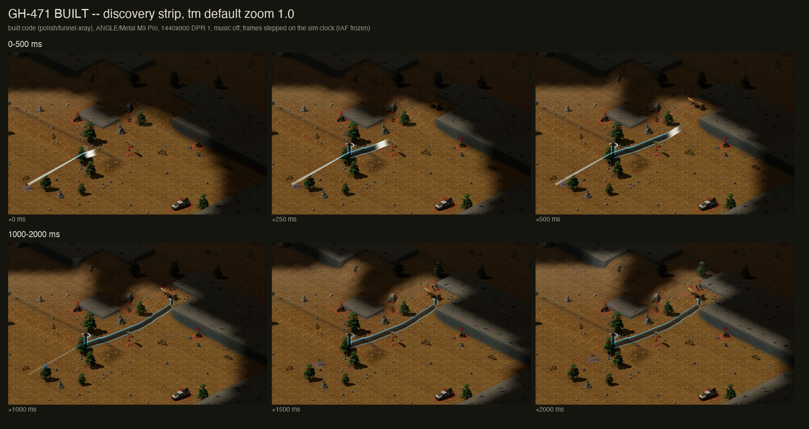
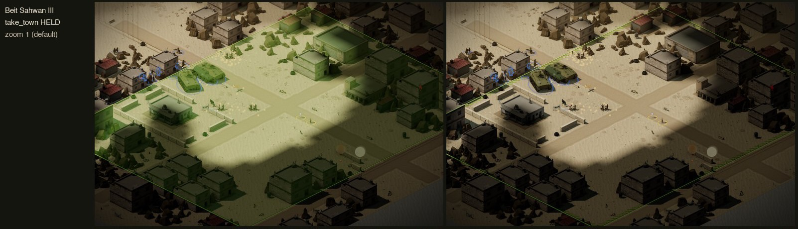

# Devlog 02: Soldiers that stop to shoot

*Roaring Lions, 4 to 9 October. Draft for the lead to publish.*

**Suggested title:** Devlog 02: Soldiers that stop to shoot, and a battlefield you can read

**One line for social posts:** A week on Roaring Lions: infantry that kneel to fire, vehicles that wear what you bought, nineteen missions on their own ground, and a briefing that reads like a field order.

---

Roaring Lions is a real-time tactics game set in the invented Kedem campaign: a small force, a fixed tick, and combat that resolves the way it should rather than the way it is convenient. This is the second fortnightly note. It covers what landed since the first.

## What landed

**Infantry stop, kneel and fire.** Squads used to fire while running. Now they halt, drop to a knee, shoot, and get up to move. The rifle sits in the right shoulder, each shot kicks one figure at a time, and every walking unit keeps its feet on the ground.

**Suppression and damage are readable.** A suppressed squad keeps its heads down. A pinned one huddles, where before it looked dead. A broken one runs bent over. The unit card and selection chips name the state: "pinned", "gun out", "suppressed, aim down 48%".

**Vehicles wear their upgrades.** Each of the eight vehicles has up to nine parts across armour, firepower and sensors, and shows the ones you bought, in the garage and on the field. The Peten helicopter's parts only read up close, because its rotor hides them at the default zoom.

**Nineteen missions on their own ground.** Nineteen missions used to share their town's map. Each now has its own: a bunded pasture, an S-bend wadi, a switchback gate. Buildings are drawn to the size of their plot, and we now measure how many fight tiles a building hides from the default camera. Wadi Halam IV went from 74% visible to 94.5%. Beit Sahwan III is still the worst, at 79%.

**A briefing that reads like a field order.** One card gives where, what happened, the objective, what matters and what to avoid. The ground is marked with your start, objectives, refuges and no-fire zones, never an enemy position. Your force appears as places, each with a veteran's record. Afterwards, one report gives the verdict, what went well, what it cost you, and what changed.

**The map says more.** An objective zone is now a hatched band on the ground instead of a green wash over the town, and a zone you do not hold has a dashed outline. The minimap shows the same states, with alert rings coloured and sized by urgency. An identified tunnel shows as a cutaway bore under the ground, with its shafts and the fighters inside.

**Explosions follow event order.** A building collapse is the strongest effect, then a vehicle kill, a shell landing, a muzzle flash. Before, a tank round's flash was about four times as bright as a Grad rocket landing.

**Colour-blind mode applies live**, with no wait for the next mission. Red over one of your units now always means the enemy; your own wounded units turn amber.

**Memory is down by about a third.** In our CI measurement a heavy mission went from about 2.8 GB to about 1.9 GB, and the menu from 1.3 to 0.9. The menu backdrop is softer on retina screens and has lost ambient occlusion.

**You can send feedback from inside the game.** Use the pause menu's Feedback tab or the main menu button: pick bug, balance, confusing, idea or praise, write a note, and optionally attach a picture, and for a bug a replay. After a mission the report asks "How was that mission?" from one to five. If something felt wrong, this is the fastest way to tell us.

No release date and no price yet. Those come with the store page.

## Design note: why the squads stop

The last devlog said nothing changed how combat resolves. This one changes it. Infantry halting to fire is a sim change, and it moved numbers.

A rifleman running and shooting at full accuracy gave the player no reason to stop. A halted squad is one you can pin and flank, which is what the suppression states exist to show.

It has a cost. The 2:1 urban fight got harder for a base-tier force: it won 63% of our test seeds before and 37% after. The lead accepted that. Squads also now close to their weapon's range instead of holding at sight range, because max-tier sensors had made a squad stand and watch an enemy it could not yet hit. The determinism hash moved and was re-pinned, with the reason.

## Captures

*Kneel, fire, move: rifle in the right shoulder, feet on the ground.*

*The eight vehicles at levels 0 to 3, at the game's own pixel size. The Peten is the bottom row.*

*Wadi Halam IV after the fit: buildings sized to their plots, and the street open.*

*The field order: the card, the marked ground, and your force as places.*

*A tunnel found on Tel Marum, from the finder's beam to the full route.*

*Left, the old zone fill. Right, the hatched band, with the town readable inside it.*

*AI disclosure: the infantry, vehicle hulls and buildings shown are Meshy-assisted, meaning AI-generated base meshes, finished, rigged and animated in Blender and code. The vehicle upgrade parts are modelled by hand. The infantry captures are Blender close-ups, not in-game frames.*
