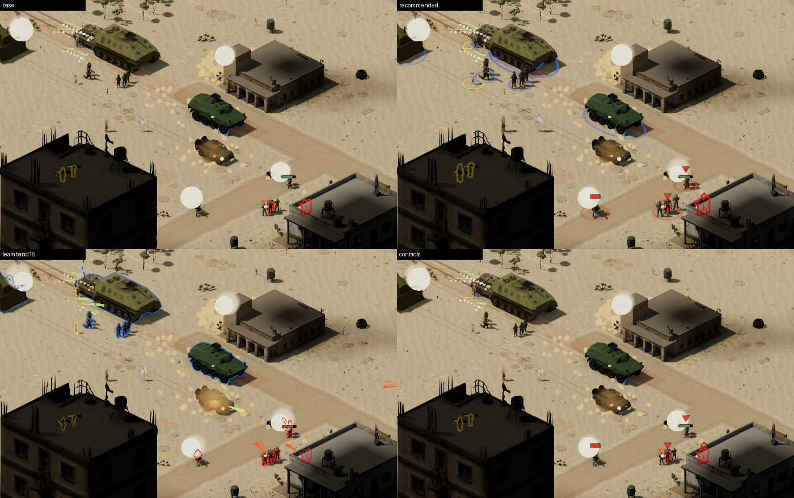
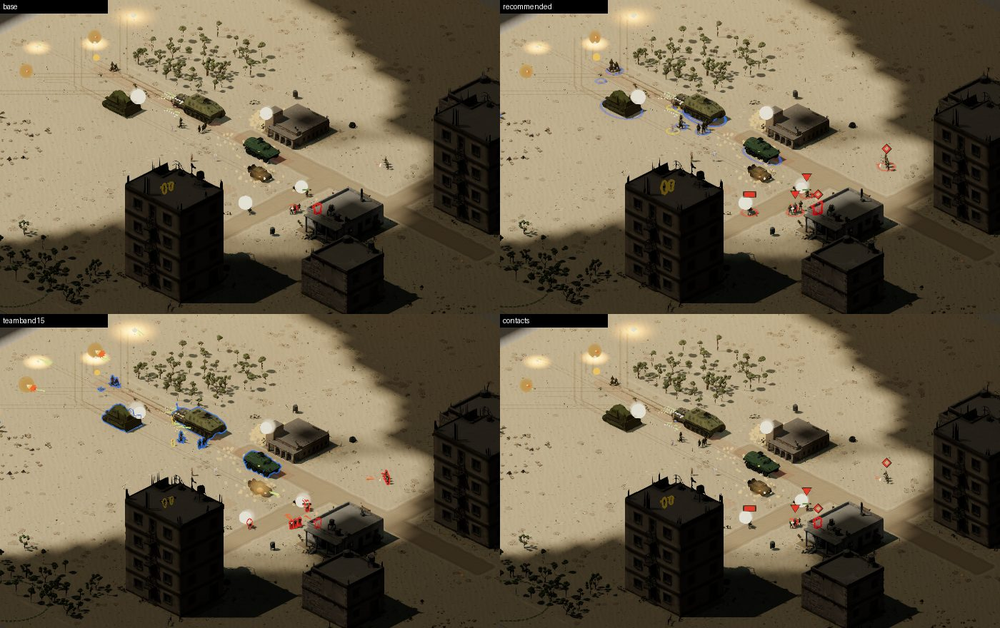
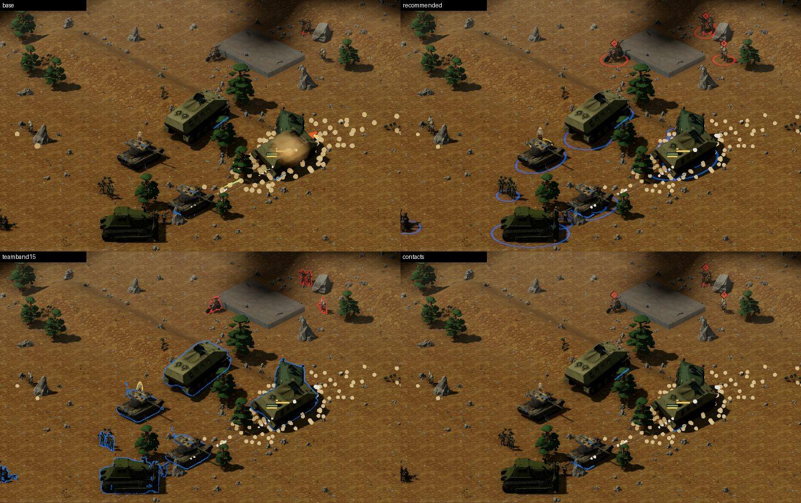
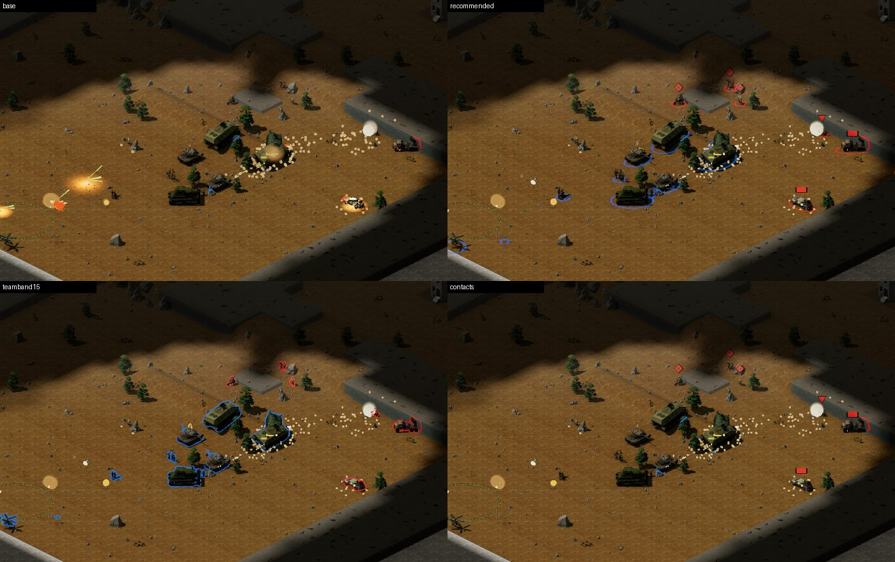
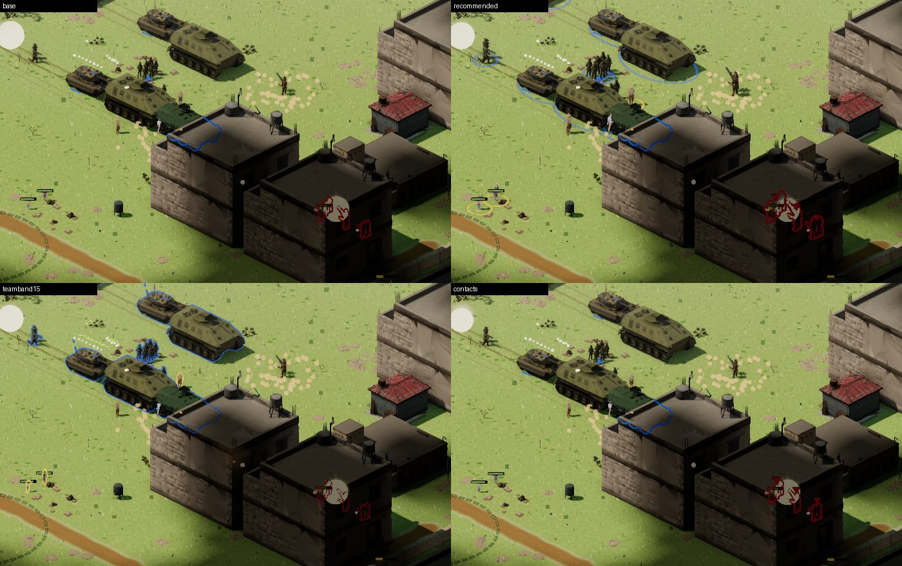
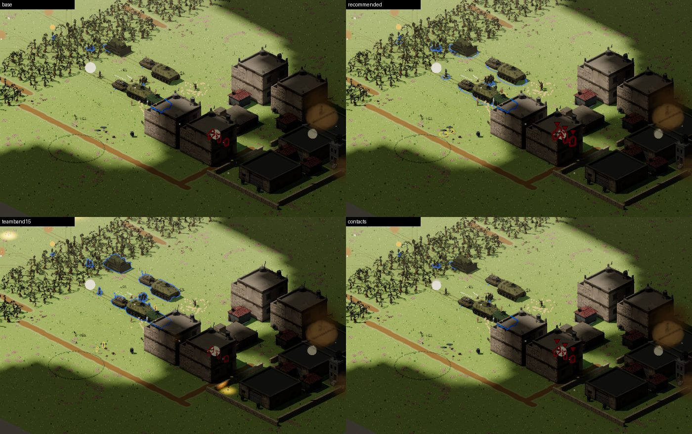

# GH-346: battlefield readability at a glance. Design

GitHub #346 · playtest critique (2 Oct), item 2 · base `main` `f1d82335` (v0.109.0, PR #342 merged) · three.js only · the sim is untouched · **nothing here ships until the lead approves**: every lever is behind its own sandbox flag and is never reachable from a mission.

## Decision (the lead, 2 Oct) and what shipped

- **Shipped as the game's default**, missions and sandbox alike, with no flag: **`bigrings`** (§3.2) and **`contacts`** (§3.3). The lead approved the contact marks as a world overlay, with the comparison page as the mock (D-3).
- **Not shipped:** `teamband`, `footscale`, `rimlift`. Their flags are removed with them, so no dead flag ships. §3.1 and §3.4 stay as the record of what was measured.
- **Where the numbers live:**
  - The rings are in `units/readability.ts`: `SELECTION_RING` (0.10 tile / 2.5 px / 0.95 / halo 0.5), `SELECTED_RING_SCALE` 1.25 and `TEAM_RING`.
  - The marks are in `units/contact-marks.ts`.
  - `readability-levers.ts` and `RendererOptions.readability` are gone.
- **Two things the prototype did not have:**
  1. **A 9×9 conforming tier.** x1.25 took the Namer's selected ellipse to 2.01 × 1.31 tiles, and the burial sweep at the drawn size (`tools/src/ring_burial_selected.test.ts`, new) buried it 0.032 wu on Tel Marum, and the D9 and Kipod 0.023, against the 0.02 limit. A ring over 1.5 tiles (`RING_XXL_TILES`) is now conformed on 9 × 9 (`RING_GRID_XXL`). A boundary sweep at 1.49 / 1.5 / 1.51 lives in `ring_burial_xxl.test.ts`.
  2. **The pulse lands on the team ring.** #342's pulse contracted to 1.15× the target's ring, and with a team ring now under every target that drew a second red ring ~3 px outside it as it landed. `TARGET_RING_SCALE` is 1, so the pulse closes onto the target's own team ring.
- **What the contact mark keeps clear of:**
  - The HP bar. Its lowest point stays above `r + 11` px at every zoom (`contact-marks.test.ts`).
  - The hit flash. That is an outline, band 6.
  - The pulse. That is a ground ring.

### Shipped measurements (2 Oct)

**How these were taken.**
- `main` at `7fa1abdf` and this branch were served side by side: two dev servers, with `main` in a second worktree.
- **Frame cost** used `readability-captures.ts --cost --targets=main@5281,branch@5271 --rounds=10`, on the staged fight on `wadi_halam_basin` at zoom 1. That was DPR 2, ANGLE/Metal on an M3 Pro, with the two trees interleaved over n = 10 rounds.
- **Gate impact** used `readability-gate-impact.ts --base-port=5281 --port=5271`, which is the gate's own capture protocol on SwiftShader.
- **Caveat.** All three runs predate the last threshold fix (`RING_XL_TILES` 1.28 → 1.23). That fix changes one thing on screen: the Grad's 1.25-tile team ring is conformed on 7 × 7 instead of 6 × 6.

**Frame cost:**

| | CPU p50 ms, median of 10 | GPU p95 ms, median of 10 (mean ± sd) | draw calls |
|---|---|---|---|
| main | 18.35 | 22.10 (22.26 ± 0.54) | 841 |
| this branch | 18.20 | 22.05 (22.22 ± 0.53) | 842 |

The cost does not resolve in the noise: −0.15 ms CPU and −0.05 ms GPU p95. The prototype's +1.1 ms on this view was the infantry ×1.3, which did not ship. The only structural cost is **+1 draw call** for the team-ring batch.

**Memory.** Large ring slots are sized for 9 × 9 now (81 vertices, was 49). With the team ring's 512 slots, the two batches hold 3.5 MiB of ring buffers (vertex attributes and indices), against 0.8 MiB for the one batch on `main`.

**Visual gate.** Differing pixels / meanAbsChannelDelta against `main`, with the box the change sits in (capture px, 1400 × 900):

| scenario | gated | control | changed | where | what |
|---|---|---|---|---|---|
| `quiet` | yes | 3 / 0.0001 | **86 / 0.0041** | 390,190–418,231 | a hollow-diamond contact mark over the hostile outlined behind the town building |
| `open-ground` | yes | 0 / 0.0000 | 0 / 0.0000 | (its unit-free region) | none |
| `vehicle` | yes | 61 / 0.0054 | **3802 / 0.1652** | 285,346–1218,678 | team rings under the whole parked force |
| `relief` | yes | 0 / 0.0000 | **83 / 0.0035** | 484,517–532,544 | a blue team ring between the corridor boulders |
| `aftermath` | yes | 0 / 0.0000 | **146 / 0.0071** | 0,218–10,248 | a team ring of a unit just off the left edge, poking in |
| `dusk` | report-only | 1 / 0.0000 | 48 / 0.0028 | 390,190–418,229 | the same mark as `quiet` |
| `combat` | report-only | 7609 / 1.3266 | 4613 / 0.2271 | whole frame | inside its own run-to-run noise |

`quiet`, `vehicle`, `relief` and `aftermath` go red and need one bless. Their layer floors do not move: the rings and marks are in the `overlays` layer, which no layer check hides, and the `units` toggle does not touch them. `aftermath`'s rule is "no unit in its frame", and a ring entering from the edge does not break that rule, so blessing it as is is proposed rather than reframing.

> "Make the fight readable at a glance. Olive-on-olive units, houses, and scrub. Contacts are tiny diamonds. Garage plates are clearer than the battlefield — that's backwards for an RTS. Bigger selection rings, stronger team-color bands, distinct silhouettes (tracks / boots / technicals) at tactical zoom. This is higher leverage than any new unit."

The comparison page (every lever, before and after, three maps, zoom 1 and 0.5, with the numbers under each pair) is `/private/tmp/claude-501/-Users-ilpinto-dev-roaring-lions/5d1f74e7-c36f-4120-a675-5c63c714fcf1/scratchpad/readability/index.html`. It is session-local, so it is not committed; the instruments that produced it are (§7), and re-running them rebuilds every number and image.

Six committed contact sheets give the same comparison in the PR. Each is a 700×440 crop at the fight, laid out as shipped (`base`), the recommendation (`recommended`: rings, contacts, infantry ×1.3), the 1.5 px team band, and contact marks alone:

| | zoom 1 | zoom 0.5 |
|---|---|---|
| beit_sahwan_outskirts |  |  |
| tel_marum |  |  |
| wadi_halam_basin |  |  |

## 1. What is on screen today

Paths are under `packages/render/src/three/` at `f1d82335`.

- **Mesh units carry no team colour at all.** The billboard sprites were authored with magenta team regions that the renderer remapped (`palette.json`, `reserved.team.role`). The mesh flip replaced them, and a mesh's colour is a ramp per role (`units/mesh-role.ts`) or a Meshy bake. Neither knows the side. So at a glance, **side is told by nothing**: the selection ring draws only when selected, the HP bar only when damaged, selected or hovered (A4), and the team-colour outline (`units/silhouette.ts`) only where the unit is hidden behind something.
- **There is no contact marker in the world.** A hostile draws only while its tile is observed this instant (`units/observed.ts`). When it does, the mesh path draws its body at full opacity, whatever `sim.contactLevel(0, i)` says: a suspected contact (level 1) looks exactly like an identified one. Only the billboard path fades by contact level (0.65 / 0.35, `frame-state.ts:675`). The only shapes that mark "something is there" are on the **minimap**: a 6 px red triangle per observed hostile (`ui/minimap.ts`, `DOT = 6`), and 8 px stroked diamonds (`DIAMOND = 8`, 11.3 px tip to tip, 1 px line) for objectives and seen story markers. Those diamonds are this document's best reading of "contacts are tiny diamonds", and the lead should confirm it (D-1).
- **The selection ring** (A4, `units/selection-ring.ts`): radius per type (`RADIUS_BY_TYPE`, foot 0.45–0.62 tile), or a hull ellipse for a ground vehicle (`ELLIPSE_BY_TYPE`). On screen, a 0.45-tile foot ring is **40.7 px wide at zoom 1 and 20.4 px at 0.5**: `2 × r × TILE_W × √½ × zoom`. Its stroke is the 1.5 px pixel floor at both zooms (0.06 tile is 1.36 px on the thin axis at zoom 1). Its halo is 0.03 tile at alpha 0.35, under a pixel.

## 2. Measurements: "olive on olive" in numbers

**Instrument:** `tools/src/perf/readability-captures.ts` (§7). Each map is set up the same way:

- **Scene.** `?sandbox=<map>&sur&civ`. The KDF ground force is attack-moved on the Sarim centroid at tick 60 and captured at tick 400. The camera sits between the KDF centroid and the nearest hostile.
- **Capture.** The frame loop is frozen. Every frame is a zero-time repaint at 1440×900, DPR 1, on ANGLE/Metal, M3 Pro, with music off.
- **What counts as a unit pixel.** A pixel is a unit's where the frame with units differs from the same frame with the `units` layer hidden (sum |ΔRGB| > 12). Two things are switched off for both frames: shadow casting on unit meshes, and the GTAO pass. With AO on, a unit's ambient halo on the sand counted as its body and overcounted a hull 2–3×. Each pixel goes to the nearest unit's body segment.
- **Statistics.** All figures are CIELAB. The ground is a ring around the unit's box. **Edge ΔE** is the mean ΔE76 across the body's boundary pixels. **Team-coloured px** is the share of a unit's pixels within ΔE76 25 of its own side's palette team colour. 25 is the separation `cvd.test.ts` holds the team colours to.
- **Pooling.** Values are medians, pooled over the units in all three maps' frames: KDF foot n = 15, KDF vehicle 18, Sarim foot 12, civilians 13. Only 2 Sarim vehicles were in frame, so that row is indicative only.
- **What the Sarim and civilian rows include.** Several of their units stand in or behind buildings, and their pixels include the occlusion outline already drawn there. That is part of why their ΔL\* (−10 to −11) is weaker than the open-ground rows below; Tel Marum's dark terra is the rest.

| zoom 1, shipped | height px | area px | body − ground ΔL* | ΔE76 | edge ΔE | team-coloured px |
|---|---|---|---|---|---|---|
| KDF foot (a team) | 48 | 506 | −32.7 | 36.0 | 26.7 | 0% |
| KDF vehicle | 80 | 3063 | −31.3 | 34.6 | 23.4 | 0.1% |
| Sarim foot | 30.5 | 321 | −10.5 | 29.9 | 27.4 | 0% |
| civilians | 39 | 294 | −11.1 | 34.9 | 26.6 | 0% |
| **zoom 0.5** | | | | | | |
| KDF foot | 24 | 128 | −30.9 | 34.7 | 25.0 | 0% |
| Sarim foot | **16** | **98** | −11.2 | 30.2 | 27.1 | 0% |
| civilians | 21 | 97 | −8.0 | 31.9 | 29.6 | 0% |

By ground (shipped, zoom 1):

| map / ground | n | ΔL* | ΔE76 | ground L* | ground hue | body hue | body C* | ground C* |
|---|---|---|---|---|---|---|---|---|
| beit_sahwan_outskirts open sand | 13 | −36.3 | 36.6 | 70.2 | 88° | 94° | 18.8 | 19.4 |
| beit_sahwan_outskirts scrub | 2 | −30.8 | 31.2 | 67.5 | 89° | 90° | 18.1 | 20.1 |
| tel_marum open (terra) | 22 | −14.2 | 23.5 | 36.8 | 73° | 92° | 14.7 | 30.7 |
| wadi_halam_basin open (green) | 6 | −34.7 | 41.5 | 69.2 | 114° | 101° | 17.5 | 39.0 |
| wadi_halam_basin scrub/grove | 11 | −14.3 | 37.3 | 63.8 | 111° | 106° | 12.3 | 33.1 |

What the numbers say, so the levers can be judged against them:

1. **"Olive on olive" is a HUE and CHROMA fact, not a value fact.** Body hue is 87–109° on every map, and the ground's is 73–114°: the same yellow-olive family. Units are *less* saturated than the ground they stand on (C\* 12–19 against 19–39), so nothing about a unit's colour says "figure" rather than "ground". On open sand they still separate by value (ΔL\* −31 to −36). That separation collapses where the ground is darker: Tel Marum's terra rossa (ground L\* 37, ΔL\* −14) and Wadi Halam's groves (ΔL\* −14).
2. **The two sides are the same colour.** The mean body ΔE76 between KDF and Sarim is 17.6 for foot on beit_sahwan_outskirts, and 10.9 for foot and 14.3 for vehicles on Tel Marum. The palette holds the TEAM colours 25 apart, and the unit bodies are not team colours at all. 0% of any unit's pixels are team-coloured unless it is behind something.
3. **Hostile infantry is small.** A Sarim fire team is 30 px tall at zoom 1 and **16 px at zoom 0.5**, about 100 px of area there. That is the size of the minimap's own marks.
4. **Lightening a unit makes it worse, measured.** Every lit unit is already darker than the ground it is read against, so any lift moves it TOWARD the sand. See the rim result in §3.4.

The `house` rows are left out of the table above. Within a tile of a building, the occlusion outline is part of what the eye sees, and it dominates the statistics: hue 32°, C\* 31–34.

## 3. The levers

Each lever is a sandbox flag registered in `packages/app/src/sandbox-help.ts`. It reaches the renderer as `RendererOptions.readability` (`packages/render/src/api.ts`), three-only, sandbox-only and never on a mission, the same shape as `decalShowcase`. The numbers are in `units/readability-levers.ts`.

**No lever adds a `renderOrder`.** Each draws in a band `units/render-order.ts` already names. Nothing reads or writes sim state beyond `contactLevel`, which the overlay loop already read.

### 3.1 Team band: `&teamband[=<px>]`

**What.** The occlusion outline (band 6) is drawn always, not only where the unit is hidden. The change is one `depthFunc` per side material (`GreaterDepth` to `AlwaysDepth`). The footprint stencil still punches out the body, so what shows is a team-colour rim at the outline's 2.5 px, or the width the flag gives. An occluded unit keeps exactly the outline it had. Its colour is already CVD-variant-aware, since it is resolved through `resolveColor` like every team key.

**Measured** (zoom 1 → 0.5):

| | team-coloured px | edge ΔE76 |
|---|---|---|
| KDF foot, 2.5 px | 0 → 37% → 46% | 26.7 → 51.2 |
| Sarim foot, 2.5 px | 0 → 50% → 61% | 27.4 → 43.2 |
| KDF foot, 1.5 px | 27% → 35% | 26.7 → 47.7 |
| Sarim foot, 1.5 px | 33% → 45% | 27.4 → 38.7 |

It is the only lever that moves inter-team separation, from the 10.9–17.6 ΔE between bodies to two palette colours held 25+ apart.

**Cost.**
- **+0 draw calls**, measured at the fight frame (593/511/836 calls before and after on the three maps). The silhouette objects were already submitted every frame and simply failed the depth test.
- Frame time: §3.6.

**Read.** At zoom 0.5 it is the strongest "who is who" of any lever. At zoom 1 it is loud on vehicles: a 2.5 px blue line round a 100 px hull. 1.5 px is calmer and keeps most of the gain.

**Caveats.**
- Band 6 draws above the overlays (4), so the rim crosses an HP bar it overlaps.
- The width uniform is shared with the occlusion outline, so `=1.5` thins that too.
- Billboards (`&nomesh`) are not covered.
- Mesh units are outside `validate:assets`, so the reserved-team-colour rule for static art is not engaged. This is a runtime overlay colour, as the occlusion outline already is.

### 3.2 Bigger rings and an always-on team ring: `&bigrings`

**What.**
- **The selected ring** is ×1.25 in radius and in its ellipse axes, with a 0.10-tile / 2.5 px-floor stroke and a 0.5 halo. A foot ring becomes 50.9 px wide at zoom 1 (was 40.7), with a 2.5 px stroke (was 1.5).
- **A second ring batch** (`teamRing`, capacity 512) draws a **faint team ring under every unselected unit** standing on open ground: the same radius and ellipse as its selection ring, core alpha 0.55, 1.5 px floor, halo 0.3.
- **Shared machinery.** It is the A4 ring machinery: per-slot cache, conforming grid, band 0.5, under the unit's feet and depth-tested. `SelectionRingBatch` takes an optional `RingStyle`. The default style is `SELECTION_RING` and produces the same shader as before. `selection-ring.test.ts`'s check that every `SELECTION_RING` number reaches the shader passes unchanged.

**Measured.**
- Body numbers are unchanged, as expected: the ring is ground, not body.
- The read is the ring itself, 40–52 px wide at zoom 1 and 20–26 px at 0.5, in team colour under every unit.

**Cost.**
- **+1 draw call** when any unit is visible, measured: 593→594, 511→512, 836→837.
- Ring vertex writes are cached per slot, so a standing unit costs no height samples. A4 measured moving rings on relief at ~0.9 ms per 100, and the team ring pays that for every MOVING unit, not just the selected ones (`docs/PERFORMANCE.md`, "Cache + accept"). Frame time: §3.6.

**Read.**
- It is the lead's own approved language (A4 G-MOCK: "Team colour + ellipse"), extended to every unit, and it is quiet. It reads well on sand and green. On Tel Marum's dark terra it is weaker, because a 1.5 px line at alpha 0.55 there is ~ΔE 20.
- It does **not** fix side identity at zoom 0.5, where the ring is ~20 px across and 1.5 px thick.

### 3.3 Contact marks: `&contacts`

**What.** A mark over every observed hostile, 22 px above its overlay radius (the HP bar is at 10). Its shape is coded by what the player knows:

| contact | mark | size (zoom 1) |
|---|---|---|
| foot, identified | downward chevron | 12 × 9.6 px |
| vehicle, identified | bar | 15 × 7.2 px |
| air, identified | upward wedge | 12 × 9.6 px |
| suspected (contact level < 2, not yet identified) | hollow diamond | 12 × 12 px |

- **Colour.** Each mark has a 1.5 px `shadow.1` halo under it and is drawn in `teamColors[1]`, so it follows the CVD variant.
- **Scale.** The overlay layer scales with zoom (faithful, CLAUDE.md), so the mark is divided by zoom below 1. It is **never smaller on screen than at zoom 1**: 12–15 px at zoom 0.5, where a Sarim team is 16 px tall.
- **Where it draws.** It is pushed into the existing `OverlayBatch` (band 4).

**Cost.** **+0 draw calls** (the same batch), and two triangle pushes per hostile: halo and fill, 2–8 triangles each.

**Read.**
- It is the clearest single lever for "where is the enemy", and the hollow diamond makes suspected contacts visible as a CLASS for the first time. On Tel Marum at tick 400, three hostiles in sight were not yet identified and wore it.
- **It is a world overlay, which the lead has rejected once** (the kit badge, `38fe0075`). The captures are its mock (D-3).
- It does nothing for a hostile out of sight. Marking last-known positions of unobserved suspected contacts would need a read-only `lastSeen` accessor for side 0, which is a `sim-guard` request and not in this prototype (D-4).

### 3.4 Silhouette separation: `&rimlift[=<power>]` (rejected) and `&footscale[=<k>]`

**Rim, measured worse.** A view-dependent fresnel rim in `limestone.0`, added to emissive radiance, with strength per ring class: foot 0.85, light 0.6, armour 0.4, air 0.5. It is patched once per unit material.

| rim | KDF foot ΔL* | KDF foot edge ΔE | Sarim vehicle ΔL* |
|---|---|---|---|
| none (shipped) | −32.7 | 26.7 | −11.2 |
| broad (power 2.2, the first cut) | −19.6 | 24.6 | **+3.6** (lighter than the terra) |
| narrow (power 4) | −29.2 | 24.2 | −4.0 |

On Tel Marum the broad rim took body ΔL\* to about 0. It lifts every unit toward the sand, because every lit unit is already darker than the ground it is read against. A DARK rim would help on sand and hurt on terra. **Recommendation: do not pursue a rim.**

**Infantry ×1.3 (`&footscale`).** This is the lever that adds AREA, and area is what 16 px infantry lacks.
- Every skinned mesh unit (infantry and civilians) is drawn 1.3× about its feet.
- The locomotion clip's `timeScale` is divided by the same factor, so a longer stride is still matched to the ground and the feet do not slide.
- **Measured:** Sarim foot height 30.5 → 39.5 px at zoom 1 and 16 → 22.5 px at 0.5. Area 321 → 487 px (+52%). KDF foot area 506 → 726 px.
- **Cost:** +0 draw calls and +0 triangles; the vertex shader is unchanged.
- **Caveats:**
  - Rings and HP bars are not rescaled.
  - A garrisoned or prone figure grows too.
  - The gait gate (`mesh_gait.test.ts`) measures the GLB, not the runtime scale, so it is unaffected.
  - This is a stylisation away from true scale, which the GDD has not ruled on (D-5).

**Vehicles** need no separate lever. Hulls are 80 px tall at zoom 1, with ΔL\* −31. What a Lavi lacks is a side, which §3.1/§3.2 supply, not a silhouette.

### 3.5 Recommended combination

**`&bigrings&contacts&footscale`, with the team band held as the zoomed-out answer (D-2).**
- **Team ring** says whose unit, in the language the lead already approved.
- **Contact marks** say where the enemy is, and whether it is identified.
- **Infantry ×1.3** gives boots the area they lack.

**Measured together** (zoom 1 → 0.5): Sarim foot 30.5 → 39 px, and 16 → 22 px. +1 draw call.

**What it does not fix.** It does not fix side identity at zoom 0.5. That is the team band's job, and the band is the louder of the two. The proposal is to enable the 1.5 px band only below a zoom threshold (e.g. < 0.7), where the ring has shrunk to 1.5 px on a 20 px ellipse. That is one comparison on `camera.zoom` in `updateSilhouetteOutlineWidth`, and it needs the lead's eye on a capture first.

### 3.6 Frame time

`readability-captures.ts --cost`, the staged fight above, DPR 2, ANGLE/Metal M3 Pro, `render-frame-cost.ts`'s method. **CPU** is `frame(1, 16)` p50 over 240 frames. **GPU** is the same call bracketed by `gl.finish()`, p95 over 120. Three interleaved rounds; the figure is the median of the three rounds.

| map, zoom | lever | CPU p50 ms (3 rounds) | Δ | GPU p95 ms (3 rounds) | Δ |
|---|---|---|---|---|---|
| beit_sahwan_outskirts z1 | base | 17.0/17.1/17.1 | — | 21.3/21.0/20.8 | — |
| beit_sahwan_outskirts z1 | teamband15 | 17.2/17.1/17.3 | +0.1 | 20.5/21.2/20.8 | -0.2 |
| beit_sahwan_outskirts z1 | bigrings | 17.3/17.3/17.5 | +0.2 | 21.0/20.8/21.0 | +0.0 |
| beit_sahwan_outskirts z1 | contacts | 16.9/17.1/17.2 | +0.0 | 20.6/21.4/20.9 | -0.1 |
| beit_sahwan_outskirts z1 | footscale | 17.3/17.3/17.0 | +0.2 | 20.9/20.9/20.8 | -0.1 |
| beit_sahwan_outskirts z1 | recommended | 17.3/17.0/17.1 | +0.0 | 20.3/20.0/20.6 | -0.7 |
| beit_sahwan_outskirts z0.5 | base | 16.4/16.3/16.1 | — | 20.6/20.0/19.9 | — |
| beit_sahwan_outskirts z0.5 | teamband15 | 16.1/16.1/16.4 | -0.2 | 19.9/19.7/20.5 | -0.1 |
| beit_sahwan_outskirts z0.5 | bigrings | 16.5/16.4/16.3 | +0.1 | 20.1/19.3/19.8 | -0.2 |
| beit_sahwan_outskirts z0.5 | contacts | 16.5/16.2/16.2 | -0.1 | 20.1/20.3/20.0 | +0.1 |
| beit_sahwan_outskirts z0.5 | footscale | 16.3/16.4/15.9 | +0.0 | 19.2/19.3/19.9 | -0.7 |
| beit_sahwan_outskirts z0.5 | recommended | 16.3/16.1/16.0 | -0.2 | 20.6/20.2/19.5 | +0.2 |
| wadi_halam_basin z1 | base | 19.6/19.2/19.6 | — | 23.0/23.6/22.8 | — |
| wadi_halam_basin z1 | teamband15 | 20.1/19.6/19.2 | +0.0 | 23.6/24.3/23.5 | +0.6 |
| wadi_halam_basin z1 | bigrings | 19.5/19.7/19.3 | -0.1 | 23.3/23.7/23.2 | +0.3 |
| wadi_halam_basin z1 | contacts | 19.6/19.6/19.9 | +0.0 | 23.4/23.5/23.4 | +0.4 |
| wadi_halam_basin z1 | footscale | 19.8/19.7/19.8 | +0.2 | 23.7/24.0/23.1 | +0.7 |
| wadi_halam_basin z1 | recommended | 20.1/19.7/19.7 | +0.1 | 24.1/24.0/24.3 | +1.1 |
| wadi_halam_basin z0.5 | base | 18.5/18.6/18.4 | — | 22.0/22.4/21.9 | — |
| wadi_halam_basin z0.5 | teamband15 | 18.5/18.7/18.7 | +0.2 | 21.6/22.6/22.0 | +0.0 |
| wadi_halam_basin z0.5 | bigrings | 18.1/18.3/18.4 | -0.2 | 23.9/21.9/22.7 | +0.7 |
| wadi_halam_basin z0.5 | contacts | 18.9/18.6/18.5 | +0.1 | 22.2/22.4/22.5 | +0.4 |
| wadi_halam_basin z0.5 | footscale | 18.7/18.6/18.7 | +0.2 | 21.7/22.4/22.4 | +0.4 |
| wadi_halam_basin z0.5 | recommended | 18.8/18.6/18.7 | +0.2 | 22.5/22.5/22.4 | +0.5 |

Read:
- **Every lever sits inside the round-to-round spread**, about ±0.3 ms CPU and ±0.6 ms GPU p95, with one exception.
- **The exception:** the recommended set on `wadi_halam_basin` at zoom 1, GPU p95 +1.1 ms (23.0 → 24.1, +4.8%, all three rounds above all three base rounds). That is the busiest view measured: 841 calls and the most units in frame.
- **Draw calls:** the ring lever is the only +1. The others' call counts vary by a few with live FX between boots, not with the lever.
- **What this does not measure:** a 300-unit fight. The team ring's moving-ring cost scales with moving units (A4: ~0.9 ms per 100 moving rings on relief). At the GDD's 300 units that alone is up to ~2.7 ms if all are moving on relief, which a shipping PR must measure with `render-frame-cost.ts` and `backend-curve-gate.ts`.

## 4. Visual-gate impact

**Shipped only behind sandbox flags, the gate moves by nothing.** The flags are off in every gated scenario.

**What moves if a lever becomes the default** was measured by `tools/src/perf/readability-gate-impact.ts`. It uses the gate's own `capture()`, `captureScript`, SwiftShader browser and `region`s. Each scenario is captured three ways: `off`, `off` again (the run-to-run control, local) and with the lever flags appended to its `sandboxFlags`.

Measured 2026-10-02 at `f1d82335` on macOS, M3 Pro, SwiftShader (the gate's own browser), against a dev server. Figures are differing pixels / meanAbsChannelDelta, with the scenario's thresholds beside them:

| scenario | gated | control (off vs off) | recommended (`bigrings,contacts,footscale`) | team band 1.5 px | thresholds |
|---|---|---|---|---|---|
| `quiet` | yes | 221 px / 0.0125 | **606 / 0.0302** | 279 / 0.0151 | 40 / 0.004 |
| `open-ground` | yes | 0 / 0.0000 | 0 / 0.0000 (unit-free region) | 0 / 0.0000 | 40 / 0.02 |
| `vehicle` | yes | 11 / 0.0011 | **7473 / 0.4329** | **4716 / 0.2931** | 300 / 0.02 |
| `relief` | yes | 0 / 0.0000 | **83 / 0.0035** | **146 / 0.0081** | 40 / 0.004 |
| `aftermath` | yes | 0 / 0.0000 | **410 / 0.0172** | 0 / 0.0000 | 40 / 0.004 |
| `dusk` | report-only | 0–2 / 0.0001 | 462 / 0.0219 | 123 / 0.0055 | — |
| `combat` | report-only | — | not reachable (a mission) | not reachable | — |

Four things to read off it:

- **`quiet`'s control is not the 0–1 px the gate documents.** It is 220 px against this dev server, measured twice. The lever is about 2.7× that, so `quiet` moves too, but its exact share there is not separable at this noise.
- **`aftermath` moves only for the ring.** A team ring of a KDF unit just outside the frame reaches in at the left edge (box 0,215–40,249).
- **`relief` moves under both.** Its drone and the corridor units come into frame.
- **`vehicle` is the big one,** for every lever, since it frames the parked force.

**Other surfaces a shipped default would move:**
- **`combat`** (report-only, a `mission=` scenario) cannot be reached by a sandbox flag. It would move: armour and infantry fight in frame.
- **The menu scene host's `register` vote** compares the host's live frame with a mission frame of the same map. It holds only if the levers apply to both. The host's four idle KDF units would wear the team ring, which is a decision in itself: a team ring on the title screen.
- **`pnpm plates:units`** photographs units through the running game for the garage. A shipped team band or ring would appear on every plate unless the plate harness turns it off. The critique's own comparison ("garage plates are clearer than the battlefield") argues for keeping plates clean.
- **`ui:shots` captures** (not gated) all move.

**Bless plan, once the lead picks:**
1. Land the chosen levers as default in one PR.
2. Run the gate there. `vehicle` (and `quiet`/`relief`/`aftermath` for the ring) are red by design.
3. Dispatch `visual-baseline-bless` with the reason, download `visual-baseline-bless-captures` and look at it, then bless Linux.
4. Re-derive any layer floor the new picture moved. The `vehicle` `units` toggle grows, because the band is a child of the unit root. Never widen a threshold.
5. `aftermath` must stay unit-free. The team ring of a unit just outside its frame pokes in (0,215 → 40,249), so either move that framing two tiles east or accept the ring in its bless; its own rule says "do not frame units back into it".

## 5. Decisions for the lead

- **D-1. What were the "tiny diamonds"?** Nothing in the world draws a contact marker. The minimap's 8 px stroked objective/story diamonds and its 6 px hostile triangles are the only small marks there are. If the critique meant the minimap, §3.3's marks are the wrong fix, and the minimap marks should grow instead (that is in `packages/app`, not here).
- **D-2. Team ring, team band, or both (band zoom-gated)?**
  - The ring is quiet and already approved in kind.
  - The band is the only lever that makes side legible at zoom 0.5, and it is loud on hulls at zoom 1.
  - Choices: 1.5 px or 2.5 px, always on or below zoom 0.7.
- **D-3. Contact marks are a world overlay.** You rejected the kit badge as ugly. Is a 12 px chevron/bar/diamond over each hostile acceptable? Alternatives: hostile-only team band, or marks only for suspected contacts.
- **D-4. Last-known positions.** Should a suspected contact that has left sight leave a fading mark where it was last seen? It needs a read-only sim accessor (`sim-guard`), not a renderer change.
- **D-5. Infantry ×1.3.** This exaggerates scale (a 1.8 m rifleman draws at 2.3 m). It is the only lever that grows 16 px infantry. Choices: ×1.3, ×1.2, or zoom-dependent (1 at zoom ≥ 1.5, rising below).
- **D-6. Rim light: drop it.** It was measured making units LESS distinct from the ground. Agree to drop?
- **D-7. Billboard parity.** None of this reaches `&nomesh` or Pixi. Fine? (VFX already owe Pixi nothing; these are not VFX.)
- **D-8. Plates.** Keep the garage plates free of the team ring and band?

## 6. Verified through the UI (prototype)

The flags were driven the way a developer reaches them, not through `__lions`:

1. On the Free play picker (`/free-play`), `bigrings`, `contacts`, `footscale` and `sur` were ticked.
2. The `beit_sahwan_outskirts` card was clicked. The link it built was `/free-play/beit_sahwan_outskirts?sur&bigrings&contacts&footscale`, and the app booted on it.
3. A KDF rifle squad was clicked with the real mouse. `renderer.selection` read back `[5]`, the squad aimed at.
4. The screenshot shows the 2.5 px selected ring on that squad, and the faint team ring under every other unit. It is on the comparison page.

`pnpm typecheck`, `pnpm lint`, `pnpm validate:ui`, `pnpm validate:assets` and `pnpm test` are green. Two specs (`shell/links.test.ts` and `ui/sandbox-menu.test.ts`) enumerate the flag record and gained the five new flags.

## 7. Instruments (committed)

- `tools/src/perf/readability-captures.ts`: the capture and measurement harness of §2/§3, and `--cost` for §3.6 and the shipped measurements. It never starts or stops a dev server, and refuses port 5177.
- `tools/src/perf/readability-gate-impact.ts`: §4.
- `packages/render/src/three/units/readability-levers.ts`: the levers' numbers and shapes.
- The prototype's five sandbox flags (`teamband`, `bigrings`, `contacts`, `rimlift`, `footscale`) and `readability-levers.ts` were removed when the lead chose. The two shipped levers are the default, and the instruments now compare two dev servers (`--targets=main@<port>,branch@<port>`, `--base-port`) rather than flags.
